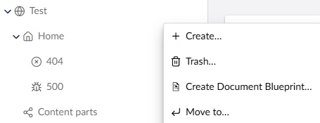
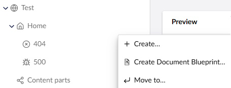

# Example: Add custom condition to existing extension

**Created**: 02-10-2025 | **Last revision:** 02-10-2025 | **Umbraco version:** 16.1.1

This is an example on how to register a custom condition to an existing extension. This is useful for when you need to change the behavior of existing extensions, especially the extensions that ship with a default Umbraco installation.

The example contains a condition that removes the delete button (or actually the 'trash' button) from the menu of a document if a condition is met. In the example, it will remove the delete button if the document type alias of the document is `Homepage`. Ofcourse in real life, the logic would probably be more complex, but this gives a good idea about the functionality.

<figure style="margin:0; margin-bottom:2rem;">
  
  <figcaption>On the 'Test' node, the Trash button is displayed, because it has an alias of 'WebsiteContainer'</figcaption>
</figure>

<figure style="margin:0; margin-bottom:1rem;">
  
  <figcaption>On the 'Home' node, the Trash button is removed, because it has an alias of 'Homepage'</figcaption>
</figure>

To add a condition to an existing extension, you need to do the following
1. Create a custom condition. See the Umbraco docs on [creating custom conditions](https://docs.umbraco.com/umbraco-cms/customizing/extending-overview/extension-types/condition#make-your-own-conditions).
2. Register it using a manifest. See the Umbraco docs on [what a manifest is](https://docs.umbraco.com/umbraco-cms/customizing/extending-overview/extension-registry/extension-manifest).
3. Append the custom condition to an existing extension by alias.

I created an example in vanilla javascript, but I will also add two additional examples in the future. One in typescript and one that uses javascript to register the manifest.

## Vanilla javascript example
In most scenarios I recommend to use typescript for it's strong typed types and it's compile time check of the code. However, sometimes you just need something to work and it doesn't need to be pretty. In that case, vanilla (or plain) javascript is fine. The VanillaJs folder contains the example written entirely in vanilla Javascript, so it does not need any compilation.

* The file [visibility-delete-button-condition.js](VanillaJs/App_Plugins/ExampleDeleteButton/visibility-delete-button-condition.js) contains the actual condition. This condition checks if the current entity is a document and tries to get document type of the that document. If the content type is the homepage, the condition is false, effectively hiding the trash/delete button.
* The file [startup.js](VanillaJs/App_Plugins/ExampleDeleteButton/startup.js) contains the logic to register our custom condition to the existing Umbraco trash/delete button.
* The file [umbraco-package.json](VanillaJs/App_Plugins/ExampleDeleteButton/umbraco-package.json) contains the manifest for the condition and the startup extensions.
### How to use it yourself?
If you want to try the code yourself, you can just copy the App_Plugins folder to the wwwroot folder of your Umbraco instance and it will work. Ofcourse you may need to change the document type alias that the condition checks on, but that is it!

## Typescript example (TBA)
This example is not yet created. This will be the same example as the VanillaJs example, but with typescript annotations and types.

## Advances example (TBA)
This example is not yet created. This will show a more advanced example using javascript to register the manifest so there is no need for the backoffice entry point.